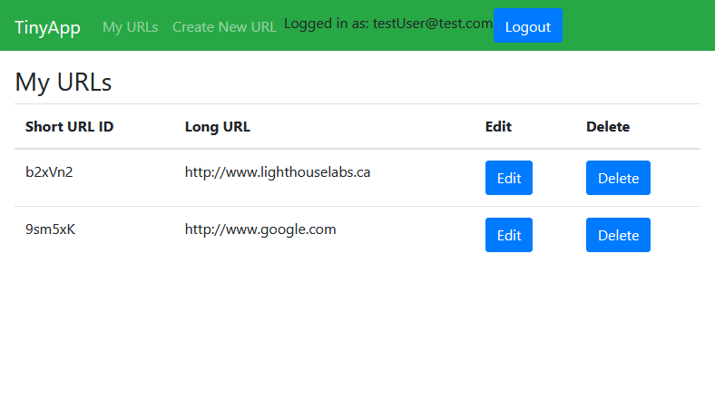

# tinyapp

A full stack web app built with Node and Express that allows users to shorten long URLs (à la bit.ly).

## Requirements

 - bcryptjs
 - cookie-session
 - ejs
 - express
 
These can be installed in the progam's directory with `npm install bcryptjs cookie-session ejs express`.

## Usage

**Run it:**

Start the server:

`node express_server.js`

Then navigate to `localhost:8080/` in your web browser and create a new account.

Only the account that created a shortened URL can see it listed and edit it, but shortened links can be used by anyone.